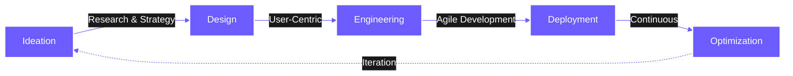

<div align="center">

<!-- Animated Header with Gradient -->
<picture>
  <source media="(prefers-color-scheme: dark)" srcset="https://res.cloudinary.com/dmkoxabbt/image/upload/v1766757687/linkedinbannerim_1_ghq9pt.png">
  <source media="(prefers-color-scheme: light)" srcset="https://res.cloudinary.com/dmkoxabbt/image/upload/v1766757687/linkedinbannerim_1_ghq9pt.png">
  
</picture>

# Imaginum

<!-- Typing Animation Effect -->
<a href="https://imaginumorg.vercel.app/">
  
</a>

<br/>

<!-- Dynamic Metrics -->


</div>

## 🌌 Welcome to Imaginum

> **Where Innovation Meets Engineering Precision**

We are a **product-focused technology organization** specializing in transforming ambitious ideas into scalable, production-grade digital products. Our mission is to bridge the gap between conceptual innovation and real-world implementation through rigorous engineering and thoughtful design.

<div align="center">

### 💫 What Sets Us Apart

</div>



## 🚀 Our Tech Universe

<div align="center">

<!-- Tech Stack with Animations -->
<table>
<tr>
<td align="center" width="25%">

<br/>React
</td>
<td align="center" width="25%">

<br/>TypeScript
</td>
<td align="center" width="25%">

<br/>Nginx
</td>
<td align="center" width="25%">

<br/>Docker
</td>
</tr>
<tr>
<td align="center" width="25%">

<br/>Python
</td>
<td align="center" width="25%">

<br/>AWS
</td>
<td align="center" width="25%">

<br/>Kubernetes
</td>
<td align="center" width="25%">

<br/>GitHub
</td>
</tr>
</table>

</div>

## 🎯 Engineering Domains

<div align="center">

<table>
<tr>
<td width="50%" valign="top">

### 🏗️ Infrastructure & Scale

```yaml
Focus Areas:
  - Distributed Systems
  - Cloud Architecture
  - Performance Optimization
  - DevOps Automation
  
Technology Stack:
  - Kubernetes & Docker
  - AWS/GCP/Azure
  - Terraform
  - CI/CD Pipelines
```

</td>
<td width="50%" valign="top">

### 🧠 Intelligence Layer

```yaml
Focus Areas:
  - AI/ML Integration
  - Natural Language Processing
  - Computer Vision
  - Predictive Analytics
  
Technology Stack:
  - TensorFlow & PyTorch
  - OpenAI APIs
  - LangChain
  - Custom Models
```

</td>
</tr>
<tr>
<td width="50%" valign="top">

### 💎 Product Engineering

```yaml
Focus Areas:
  - Full-Stack Development
  - Mobile Applications
  - Progressive Web Apps
  - API Architecture
  
Technology Stack:
  - Next.js & React
  - React Native
  - GraphQL & REST
  - Microservices
```

</td>
<td width="50%" valign="top">

### 🔒 Security & Reliability

```yaml
Focus Areas:
  - Security-First Development
  - Penetration Testing
  - Data Encryption
  - Compliance Standards
  
Technology Stack:
  - OAuth 2.0 / JWT
  - GDPR Compliance
  - SOC 2
  - ISO 27001
```

</td>
</tr>
</table>

</div>

## 📊 Organization Activity

<div align="center">

<a href="https://github.com/YOUR_ORG_NAME">
  
</a>
<a href="https://github.com/YOUR_ORG_NAME">
  
</a>

</div>

## 🤝 Collaboration

<div align="center">

We work across multiple engagement models to deliver value:

**Open Source Contributions** • **Strategic Partnerships** • **Custom Development** • **Technical Consulting**

Our clients range from early-stage startups to established enterprises, spanning technology, education, and business sectors.

</div>

## 🎓 Development Standards

<div align="center">

| Standard | Implementation |
|:---:|:---|
| **Code Quality** | Peer-reviewed code with automated quality gates and comprehensive testing coverage |
| **Performance** | Sub-second response times with horizontal scalability and efficient resource utilization |
| **Security** | Industry-standard encryption, regular security audits, and compliance with data protection regulations |
| **Architecture** | Microservices-based design with API-first approach and cloud-native deployment strategies |
| **Testing** | Unit, integration, and end-to-end testing with minimum 80% code coverage requirements |
| **Documentation** | Technical specifications, API documentation, and deployment guides maintained throughout development lifecycle |

</div>

## 💼 Partnership Opportunities

<div align="center">

### We deliver end-to-end digital solutions for organizations at every stage

<table>
<tr>
<td align="center" width="33%">

**Early-Stage Ventures**

Rapid MVP development with production-ready architecture, technical validation, and go-to-market support

</td>
<td align="center" width="33%">

**Growth Companies**

Platform modernization, infrastructure scaling, and feature development to support business expansion

</td>
<td align="center" width="33%">

**Enterprise Clients**

Legacy system modernization, cloud migration, and custom solutions for complex business requirements

</td>
</tr>
</table>

<br/>

**Ready to discuss your project?**

<a href="https://imaginumorg.vercel.app/">
  
</a>
&nbsp;&nbsp;
<a href="https://imaginumorg.vercel.app/">
  
</a>
&nbsp;&nbsp;
<a href="mailto:contact@imaginum.com">
  
</a>

</div>

## 📫 Connect With Us

<div align="center">

<a href="https://imaginumorg.vercel.app/">
  
</a>
<a href="https://github.com/imaginum">
  
</a>
<a href="https://linkedin.com/company/imaginum">
  
</a>
<a href="https://twitter.com/imaginum">
  
</a>

</div>
<br/>
<div align="center">


**Imaginum Organization** • *Engineering Tomorrow's Solutions Today*

**© 2025 Imaginum** • All Rights Reserved • Built with 💜 and ☕

<sub>Made with precision by the Imaginum Engineering Team</sub>

</div>
